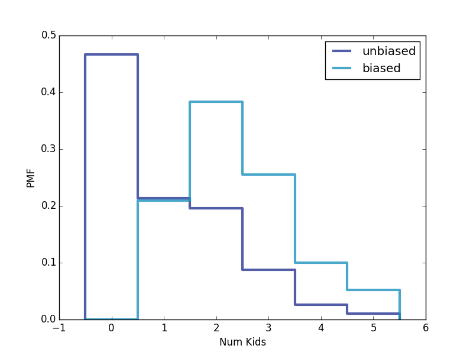

[Think Stats Chapter 3 Exercise 1](http://greenteapress.com/thinkstats2/html/thinkstats2004.html#toc31) (actual vs. biased)

>> I got to the solution first by following chap03ex.ipynb after struggling to get the numkdhh data (didn't realize initially that information was in the response data and not the pregnancy data). After that I followed the examples in the book, copying the BiasPmf function and how to plot the PMFs. In the unbiased PMF, more families responded with having 0 kids than families with 1,2,3,4 or 5 kids. The biased PMF, which I believe shows what children surveyed would have responded about the size of their family, removes the families with 0 kids (since no kid could respond) and biases the other family sizes. Families of 2 kids becomes the mode of the biased sample.

```
import thinkstats2
import chap01soln
import thinkplot

def BiasPmf(pmf, label):
    new_pmf = pmf.Copy(label=label)

    for x, p in pmf.Items():
        new_pmf.Mult(x, x)

    new_pmf.Normalize()
    return new_pmf


resp = chap01soln.ReadFemResp()
numkd = resp.numkdhh
histnumkids = thinkstats2.Hist(numkd, label='actual')
print("Hist of numkdhh: {}".format(histnumkids))
unbiasednumkids = pmf = thinkstats2.Pmf(numkd, label='unbiased')
print("PMF of unbiased numkdhh: {}".format(unbiasednumkids))
biasednumkids = BiasPmf(unbiasednumkids, label='biased')
print("PMF of biased numkdhh: {}".format(biasednumkids))

thinkplot.PrePlot(2)
thinkplot.Pmfs([unbiasednumkids, biasednumkids])
thinkplot.Show(xlabel='Num Kids', ylabel='PMF')
```


