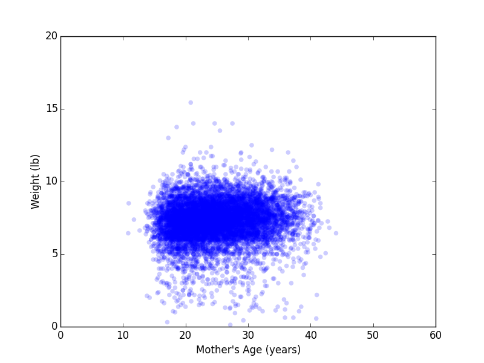
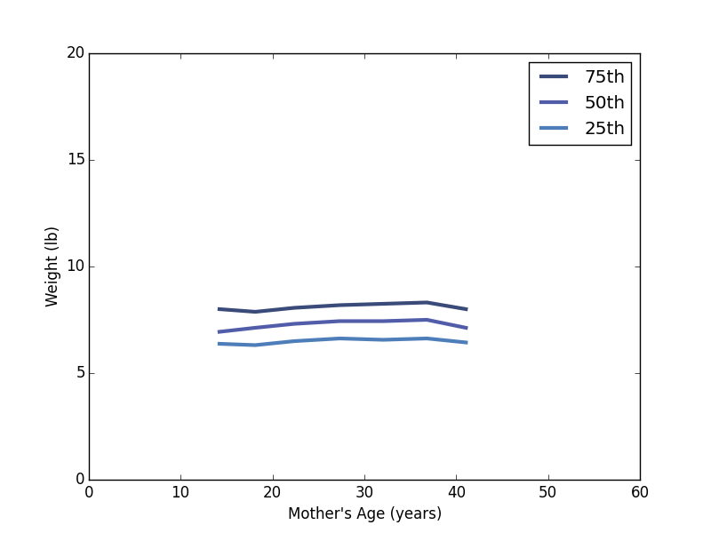

[Think Stats Chapter 7 Exercise 1](http://greenteapress.com/thinkstats2/html/thinkstats2008.html#toc70) (weight vs. age)

>> I came to my answer by following the example codes in the book. I used earlier code to read the Pregnancy data and then stored the live pregnancies in a variable, and removed the samples that had NAN for 'agepreg' and 'totalwgt_lb'. Then I followed the books examples for plotting scatter plots and the percentile plots. The book also said that the 'thinkstats2' code had methods for getting the Pearson's and Spearmans correlation coefficients. The results were as follows:

>>Pearsons Correlation Coefficient: 0.06883397035410906

>>Spearmans Correlation Coefficient: 0.09461004109658226

>>The Spearmans Coefficient shows that there may be some outliers that, when accounted for in the Spearmans method, would make the data have a slightly better correlation. However, neither of the data has very strong correlation as both are less than 0.1.

>>The scatter plot and percentile plot can be found below.


```
import nsfg
import thinkplot
import numpy as np
import thinkstats2


preg = nsfg.ReadFemPreg()
live = preg[preg.outcome == 1]
live = live.dropna(subset=['agepreg', 'totalwgt_lb'])
age, weights = live.agepreg, live.totalwgt_lb

#Scatter Plot
thinkplot.Scatter(age, weights, alpha=0.2)
thinkplot.Show(xlabel='Mother\'s Age (years)',
               ylabel='Weight (lb)',
               axis=[0, 60, 0, 20])

#Percentiles
bins = np.arange(5, 50, 5)
indices = np.digitize(live.agepreg, bins)
groups = live.groupby(indices)
ages = [group.agepreg.mean() for i, group in groups]
cdfs = [thinkstats2.Cdf(group.totalwgt_lb) for i, group in groups]
for percent in [75, 50, 25]:
    weights = [cdf.Percentile(percent) for cdf in cdfs]
    label = '%dth' % percent
    thinkplot.Plot(ages, weights, label=label)
thinkplot.Show(xlabel='Mother\'s Age (years)',
               ylabel='Weight (lb)',
               axis=[0, 60, 0, 20])

#Pearsons Coefficient
weights = live.totalwgt_lb
pearsons = thinkstats2.Corr(age, weights)
print("\n\nPearsons Correlation Coefficient: {}".format(pearsons))

#Spearmans Coefficient
spearmans = thinkstats2.SpearmanCorr(age, weights)
print("\n\nSpearmans Correlation Coefficient: {}".format(spearmans))


```
Scatter Plot



Percentiles of birght weight (lbs) for a range of binned Mothers' ages

