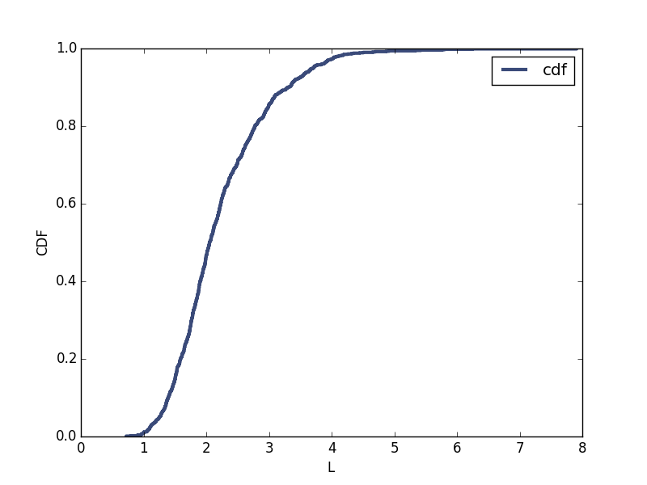
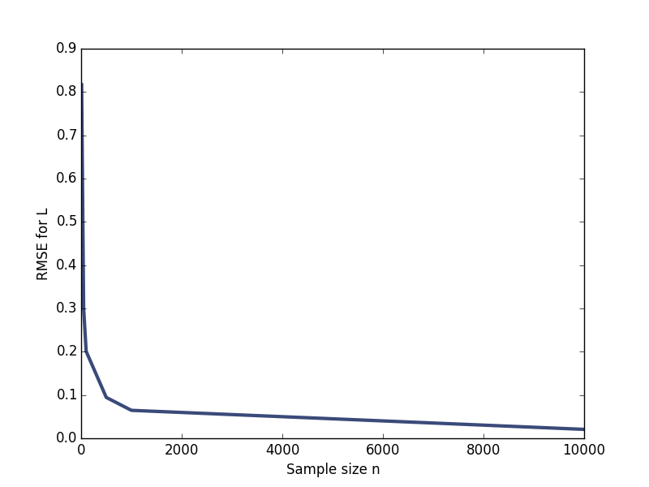

[Think Stats Chapter 8 Exercise 2](http://greenteapress.com/thinkstats2/html/thinkstats2009.html#toc77) (scoring)

>> I arrived at my code by following the exponential distributions examples in the book. I created a function that takes a sample size n, an expected lambda, and the number of simulations to be run, m. It then creates a sample of size n from an exponential distribution and calculates and stores the mean of this sample. This repeats m times. A CDF is determined from the m means and a 90% confidence interval is stored. It prints out the RMSE as calculated in estimation.py (provided by the book), the mean error, and the confidence interval. If the sample size was 10 then it also outputs the plot of the CDF of the L estimates as required by the question. Finally it returns the RMSE value for that simulation.

>> The script then stores the RMSE values for simulations with sample sizes n = 10, 50, 100, 500, 1000, and 10000. The RMSE values are then plotted against the sample sizes. These plots can be found at the bottom of this page.

>>The standard error values and the confidence intervals for all of the simulations can also be found below.

SCRIPT:
```
import estimation
import thinkplot
import thinkstats2
import numpy as np
import math

#plot sampling distribution of estimate L
#Compute standard error of L
#Computer 90% CI
n=10
lam=2
m=1000

#taking the code from estimation.py
def simulation(n=n, lam=lam, m=m):
    means = []
    for _ in range(m):
        xs = np.random.exponential(1.0/lam, n)
        L = 1 / np.mean(xs)
        means.append(L)
        
    cdf = thinkstats2.Cdf(means)
    ci = cdf.Percentile(5), cdf.Percentile(95)

    print('\nFor n = ', n)
    print('rmse L', estimation.RMSE(means, lam))
    print('mean error L', estimation.MeanError(means, lam))
    print('90%CI is {}'.format(ci))

    if n==10:
        thinkplot.Plot(cdf, label="cdf")
        thinkplot.Show(xlabel='L',
                       ylabel='CDF')
    
    return estimation.RMSE(means, lam)

sample_sizes = [10,50,100,500,1000,10000]
rmses = [simulation(size) for size in sample_sizes]
    
    
thinkplot.Plot(sample_sizes, rmses)
thinkplot.Show(xlabel='Sample size n',
               ylabel='RMSE for L')
    
```


OUTPUT:
```
For n =  10
rmse L 0.8169265122009649
mean error L 0.224386433028
90%CI is (1.2487002334587245, 3.7016319798007964)

For n =  50
rmse L 0.30014717104316846
mean error L 0.043171534091
90%CI is (1.5786072731168308, 2.5441498253076604)

For n =  100
rmse L 0.2009541546484421
mean error L 0.0191086344072
90%CI is (1.7088637408825749, 2.3487031543079286)

For n =  500
rmse L 0.09442650928374652
mean error L 0.0020669475543
90%CI is (1.8524352744918453, 2.1671844100596616)

For n =  1000
rmse L 0.06459062281402417
mean error L 0.00176986042168
90%CI is (1.8960363386515633, 2.1118203038482526)

For n =  10000
rmse L 0.02064626829045986
mean error L 0.000673783933997
90%CI is (1.9660053658885497, 2.0347991816451052)
```

CDF Plot of L estimates for n = 10



Plot of RMSE values for L at various n sample sizes


